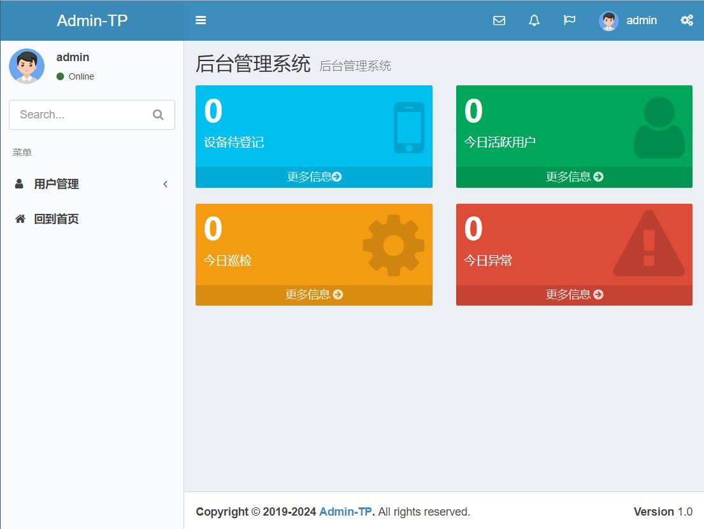
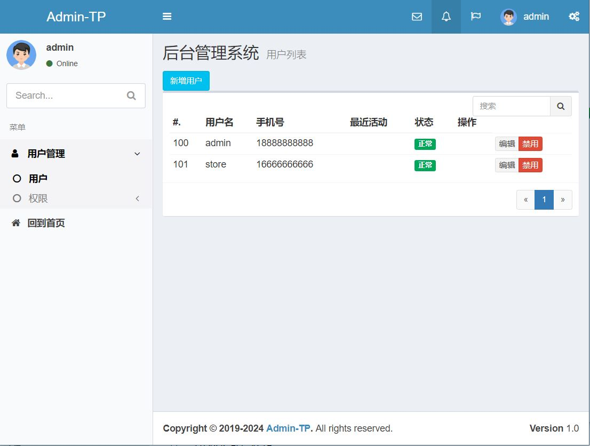
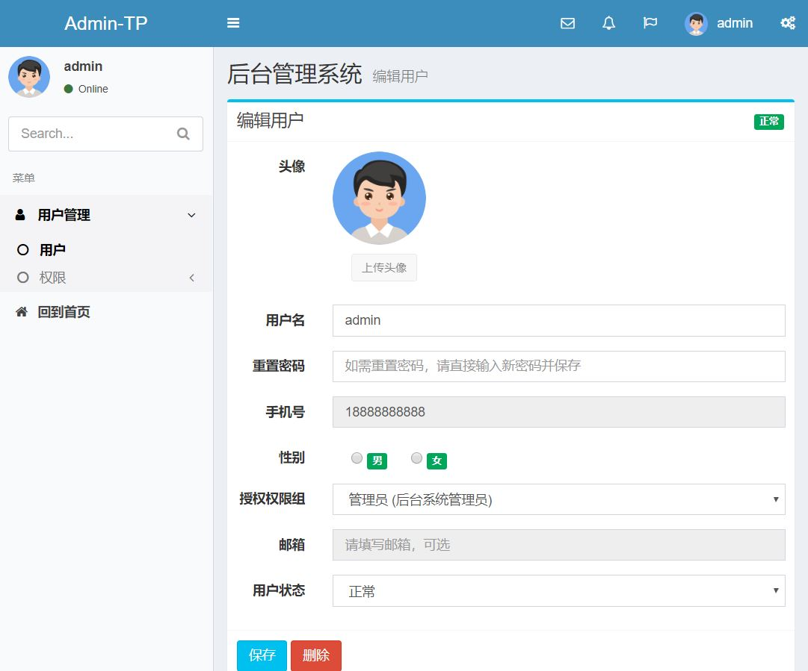
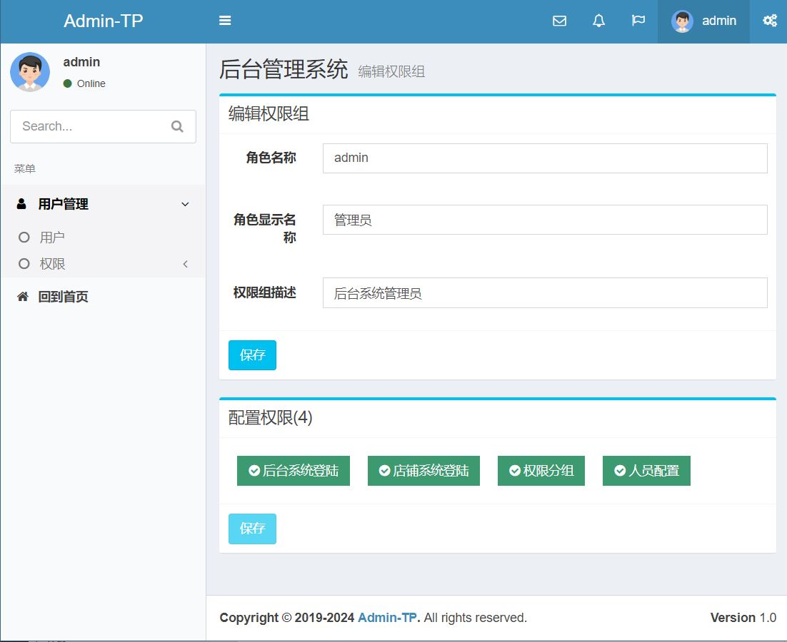

# Admin-TP

## 描述

基于Admin-LTE的laravel后台管理系统集成，集成的功能如下：

- 基本的数据库结构和测试数据填充
- 后台登陆界面
- 后台主页和左侧菜单栏
- 用户列表页
- 角色权限
- 修改用户属性以及权限
- 汉化

使用此集成代码可以快速地从无到有创建一个美观易用的后台系统。







## 使用方法

```bash
# 下载到本地登陆shell并切换到应用目录
# 安装composer依赖组件
composer install

# 安装 npm 资源组件
npm install

# 配置自己的.env 环境
mv .env.example .env

# 运行迁移和基本的数据填充
php artisan migrate --seed

# 暴露资源目录
php artisan storage:link

# 静态资源压缩并输出到public目录
# 调试错误 npm run dev
npm run prod

```

命令执行完后，就可以登陆 {APP_URL}/admin,输入18888888888/123456（由UsersTableSeeder填充的默认用户数据）登陆后台系统。  

在此基础上，可以修改或者拓展成为更复杂的后台系统，也可以添加API组来构建API服务，Site组构建网站服务等。